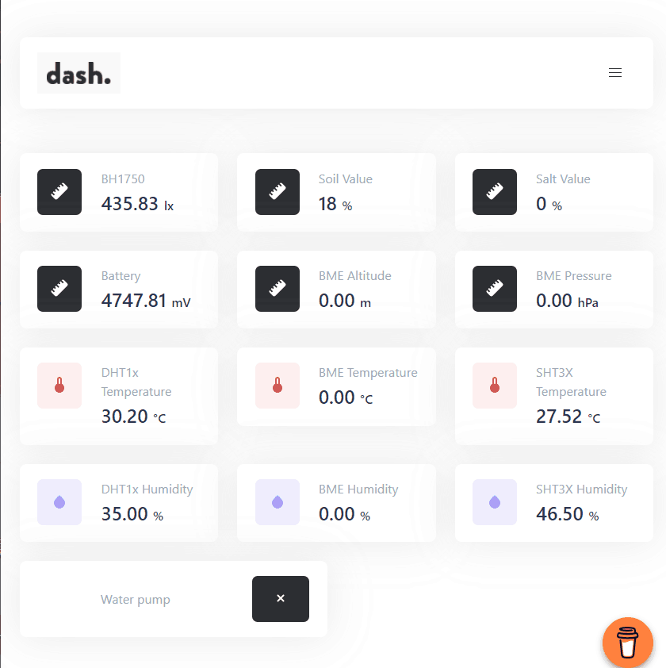

<h1 align = "center">🌟LilyGO HiGrow🌟</h1>

## Using **Arduino IDE**

1. Install the current upstream Arduino IDE at the 1.8 level or later. The current version is at the [Arduino website](http://www.arduino.cc/en/main/software).
2. Start Arduino and open Preferences window. In additional board manager add url: https://raw.githubusercontent.com/espressif/arduino-esp32/gh-pages/package_esp32_index.json .separating them with commas.
3. Copy or move the folder in the **lib** directory to `<C:\Users\Your User Name\Documents\Arduino\libraries>` 
4. Board select `Tools` -> `Board` -> `ESP32 Dev Module`
5. In `configuration.h`, you can select hotspots and connect to wireless WiFi, and you can change and add sensors. For details, please refer to `configuration.h` 
6. Build and Upload the sketch
7. View the obtained ip address in the serial output,  enter the ip address in the browser to view the data.

## Using **PlatformIO**

1. Install [VSCODE](https://code.visualstudio.com/) and [Python](https://www.python.org/)
2. Search for the PlatformIO plug-in in the VSCODE extension and install it.
3. After the installation is complete and the reload is completed, there will be a small house icon in the lower left corner. Click to display the Platformio IDE home page
4. Go to file - > `Open folder` - > Select the `LilyGo-HiGrow` 
5. Click the (√) symbol in the lower left corner to compile (→) for upload.

