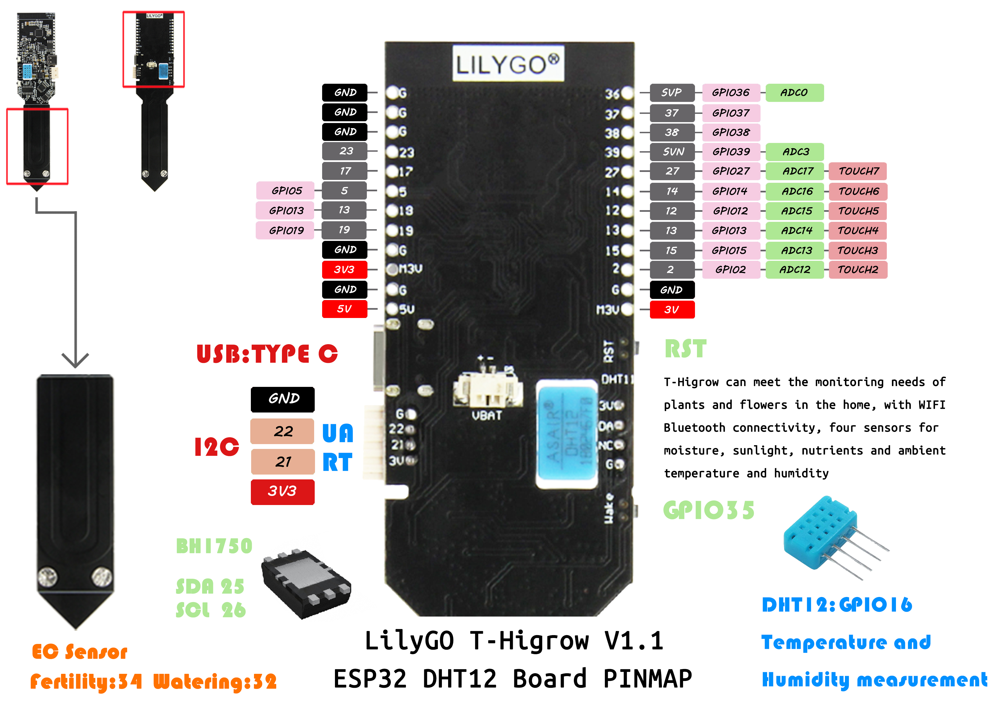
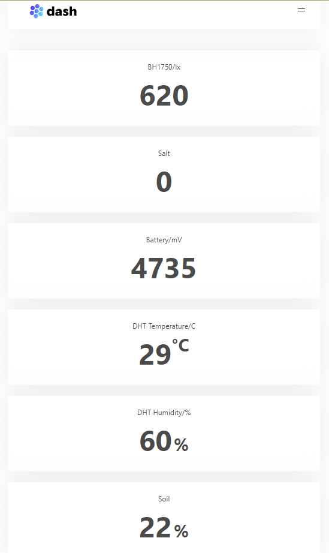

TTGO HiGrow
===========================

### Quick start:
- Copy or move all directories in the <libraries> folder to <C:\Users\Your User Name\Documents\Arduino\libraries>

- Use Arduino ESP32 Sketch data Upload files,if you not install,[download ESP32FS-vX.zip](https://github.com/me-no-dev/arduino-esp32fs-plugin/releases),Extract to <C:\Users\Your User Name\Documents\Arduino\tools>,Open Ardunio IDE,  Tools -> ESP32 Sketch data Upload -> Upload

- Modify `WIFI_SSID`, `WIFI_PASSWD` in the file, or configure the network using [EspTouch] (https://www.espressif.com/en/products/software/esp-touch/resources)

- Build and Upload the sketch

- View the obtained ip address in the serial output,  enter the ip address in the browser to view the data.

### Peripheral description
- BOOT Button long press enter smartconfig mode
- User Button long press enter deepsleep mode

### 3D file

